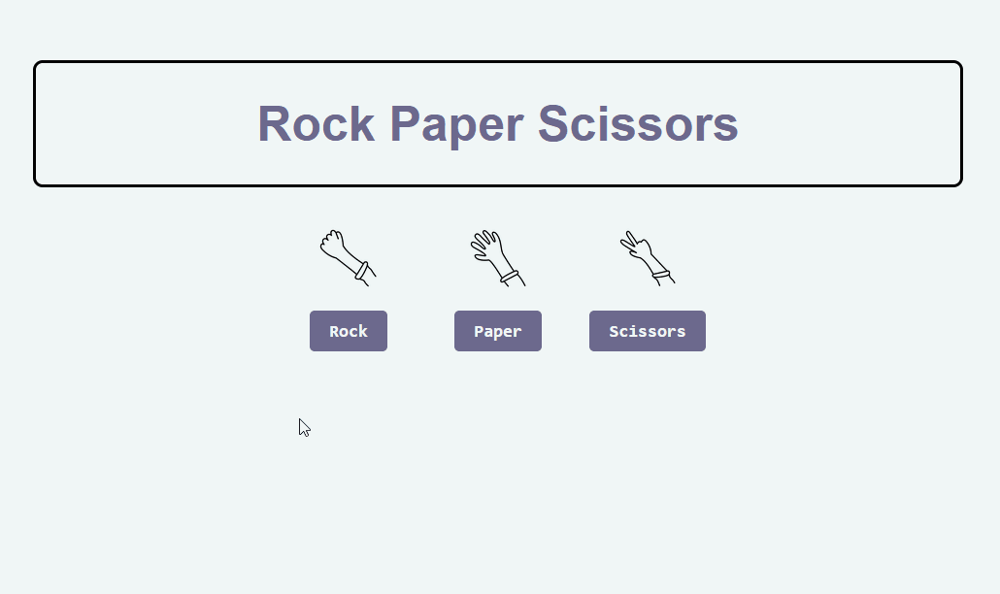

# Rock-Paper-Scissors
A simple take on the classic Rock Paper Scissors game in JavaScript, HTML, and CSS. The game allows a user to play against an automated opponent in the browser.

## Description
-User can select their choice of rock, paper, or scissors by clicking on a button.

-The computer opponent generates a random choice.

-The game determines the winner based on the rules of Rock Paper Scissors.

-The result is displayed on the screen, indicating whether the user won, lost, or tied the game.

-An image is shown below the result text, representing the outcome of the game (happy face for a win, sad face for a loss, and neutral face for a tie).

## Technologies Used
-HTML

-CSS

-Javascript

## How To Play

-Clone this repository

-Open the HTML file in your browser

# Enjoy playing Rock Paper Scissors!

